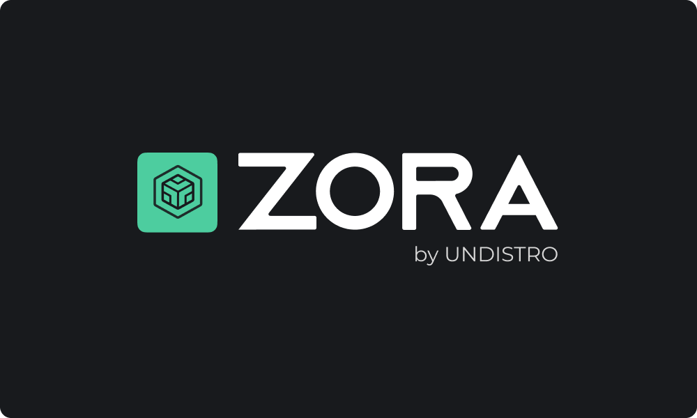

# Zora (Alpha Release)

## Introduction

Zora is a multi-cluster scan that helps you identify potential issues and vulnerabilities
in your Kubernetes clusters in a centralized way, ensuring that the recommended best practices are in place.

Zora is the first product created by Undistro's initiative. Visit our [website](https://undistro.io) for more information about the project and sign up for our newsletter to stay up to date with Zora's new features and Undistro's new initiatives.

## Getting Started

Check out our live [documentation](https://zora.undistro.io) for details about how to install Zora and start to scan your clusters.

## Contributing

We are in alpha stage and we'd love it if you contributed to Zora. For information on contributing to this project, please see our [guideline](https://github.com/getupio-undistro/zora/blob/main/CONTRIBUTING.md).

## License

Zora is a Undistro product, backed by [Getup.io](https://getup.io) under the [Apache License 2.0](LICENSE)
