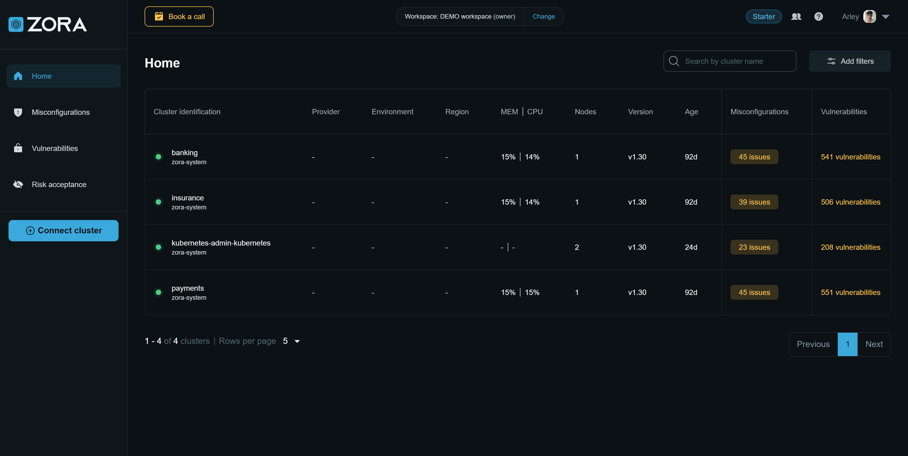

# Zora Dashboard

Zora Dashboard is a SaaS platform designed to seamlessly centralize the security posture management of all your
Kubernetes clusters, providing a full experience powered by Zora OSS.

It features a powerful UI that allows you to navigate, filter and explore details of issues and affected resources
across all your clusters. You can also invite users to your workspace.



<div align="center">
   <a href="https://zora-dashboard.undistro.io/" class="md-button">Try Zora Dashboard</a>
</div>

Currently, it's free for up to 3 clusters.
Please [contact us](https://undistro.io/contact){:target="_blank"} if you need unlock more clusters in Zora Dashboard.

## Getting started

To integrate your cluster with Zora Dashboard, you need to provide the workspace ID
as an additional parameter in Zora OSS installation command.

1. Sign in at [Zora Dashboard](https://zora-dashboard.undistro.io){:target="_blank"};
2. Click on "Connect cluster" button and copy the workspace ID;
3. Then provide it in `saas.workspaceID` parameter in [Zora OSS installation command](getting-started/installation.md):

=== "HTTP chart repository"
    
    ```shell hl_lines="9"
    helm repo add undistro https://charts.undistro.io --force-update
    helm repo update undistro
    helm upgrade --install zora undistro/zora \
      -n zora-system \
      --version 0.7.0 \
      --create-namespace \
      --wait \
      --set clusterName="$(kubectl config current-context)" \
      --set saas.workspaceID=<YOUR WORKSPACE ID HERE>
    ```

=== "OCI registry"

    ```shell hl_lines="7"
    helm upgrade --install zora oci://ghcr.io/undistro/helm-charts/zora \
      -n zora-system \
      --version 0.7.0 \
      --create-namespace \
      --wait \
      --set clusterName="$(kubectl config current-context)" \
      --set saas.workspaceID=<YOUR WORKSPACE ID HERE>
    ```


## Architecture

Zora OSS acts as the engine of Zora Dashboard, meaning that once scans are completed,
**only the results are sent to Zora Dashboard**, where they are accessible by you
and those you have invited to your workspace.


Note that these results do not contain sensitive information or specific data about your cluster configuration.
