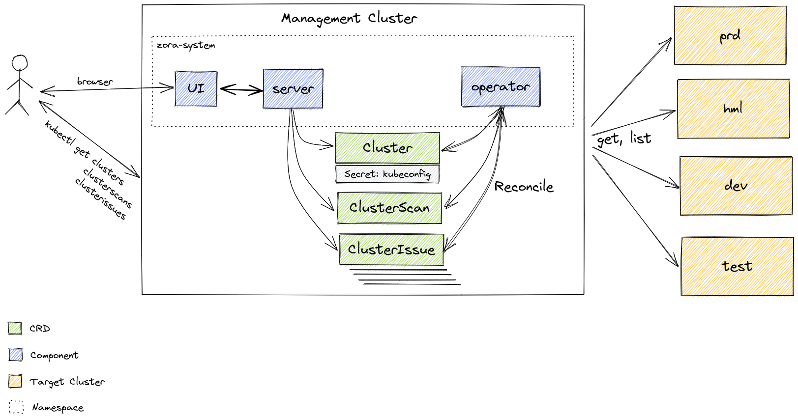

# Introduction

## What is Zora?

Zora is a multi-cluster scan that helps you to identify potential issues and vulnerabilities 
in your Kubernetes clusters in a centralized way, ensuring that the recommended best practices are in place.

Throughout this documentation, we will use the following notation:

- **[Management Cluster](/glossary#management-cluster)** to refer to the only Kubernetes cluster where Zora is installed;
- **[Target Cluster](/target-cluster)** to refer to all clusters you will connect to Zora to be scanned.

Follow these steps to get started with Zora:

1. [Install Zora](/install) in a [Management Cluster](/glossary#management-cluster)

2. [Prepare the target cluster](/target-cluster) by creating a service account and generating a kubeconfig

3. [Connect the target cluster to Zora](/connect-cluster)

4. [Configure a scan for the target cluster](/cluster-scan)

5. After a successful scan [checkout the potential reported issues](/cluster-scan#list-cluster-issues)

All the information about these steps are detailed throughout this documentation.

## Architecture

## Zora origins

In the early days of the cloud native era, [Borg](https://intl.startrek.com/database_article/borg) dominated the container-oriented cluster management scene.
The origin of the name Borg refers to the cybernetic life form existing in the Star Trek series, 
that worked as a collective of individuals with a single mind and the same purpose, as well as a "[cluster](https://pt.wikipedia.org/wiki/Cluster)".

As good nerds as we are and wishing to honor our Kubernetes' [predecessor](https://kubernetes.io/blog/2015/04/borg-predecessor-to-kubernetes/) (Borg) we named our project [Zora](https://intl.startrek.com/node/15372).

In Star Trek, Zora is the Artificial Intelligence that controls the ship U.S.S Discovery.  
After being merged with a collective of other intelligences, Zora became sentient and became a member of the team, bringing insights and making the ship more efficient.

Like Star Trek's Zora, our goal is to help manage your K8s environment by periodically scanning all of your clusters, 
looking for potential issues or vulnerabilities with deployed features and configurations, and helping you ensure compliance with the best practices.
